# Security Dashboard

**An authentication monitoring and investigation workspace.**

[](https://github.com/VedantBandre/Security-Dashboard/actions/workflows/ci.yml)

Security Dashboard is a local SOC demo built with **React, Vite, Django REST Framework, and SQLite**. It turns reported login activity into searchable events, captures evidence when detection rules trigger, and lets analysts track investigations through to a recorded resolution.

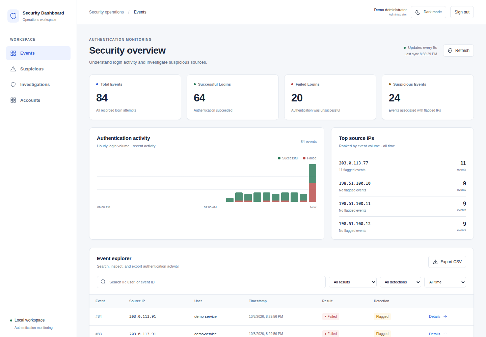

> Screenshots show the real application with synthetic accounts and documentation-range IP addresses. The project is a single-workspace local demo; public production deployment remains future work.

## Contents

- [Feature map](#feature-map)
- [Quick start](#quick-start)
- [Generate demo activity](#generate-demo-activity)
- [Workspace guide](#workspace-guide)
- [Your first investigation](#your-first-investigation)
- [Roles and access](#roles-and-access)
- [Detection behavior](#detection-behavior)
- [Architecture and API](#architecture-and-api)
- [Development and CI](#development-and-ci)
- [Troubleshooting](#troubleshooting)
- [Scope and next steps](#scope-and-next-steps)

## Feature map

| Area | What you can do | Where to start |
| --- | --- | --- |
| Monitoring | See event counts, hourly activity, and the busiest source IPs | **Events** |
| Event exploration | Search, filter, page through results, inspect raw records, and export CSV | **Events → Details** |
| Suspicious activity | Review events flagged by the detection rules | **Suspicious** |
| Detection evidence | Read the rule, threshold, observed count, time window, and captured events | **Investigations → Findings** |
| Case management | Open a case, assign an analyst, set severity, and track status | **Investigations → Cases** |
| Decisions and history | Add attributed notes, resolve with a reason, and reopen cases | **Open case** |
| Account administration | Provision accounts, change roles, deactivate access, and review access history | **Accounts**, administrator only |
| Appearance | Switch between light and dark mode; remember your choice locally | Top-right theme button |
| Quality checks | Run lint, tests, builds, migration checks, and dependency audits | Local checks and GitHub Actions |

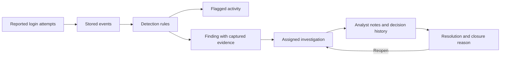

## Quick start

### Requirements

- Python **3.12 or 3.14**, with virtual environment support.
- Node.js **22.22.2+ within 22.x**, or **24.15+ within 24.x**, with npm.
- Git and two terminal windows.

Clone the repository:

```bash
git clone https://github.com/VedantBandre/Security-Dashboard.git
cd Security-Dashboard
```

### 1. Start the backend

From the repository root:

```bash
python3.12 -m venv backend/venv
source backend/venv/bin/activate
python -m pip install -r backend/requirements.txt
python backend/manage.py migrate
python backend/manage.py createsuperuser
python backend/manage.py runserver 127.0.0.1:8000
```

Use `python3.14` instead if that is your installed supported Python. On Windows, activate with `backend\venv\Scripts\Activate.ps1` in PowerShell.

Keep this terminal running. Migrations create `backend/db.sqlite3`; it persists across restarts and is ignored by Git. The administrator username and password are the ones you choose during `createsuperuser`.

### 2. Start the frontend

In the second terminal:

```bash
cd Security-Dashboard/frontend
npm ci
npm run dev
```

If this terminal is already at the repository root, use `cd frontend` instead. Open the URL printed by Vite, normally **http://localhost:5173**. Its proxy forwards API requests to the backend on port 8000.

### 3. Sign in

Sign in with your administrator account. Use **Accounts** to create individual Analyst and Viewer accounts. There are no shared default login credentials.

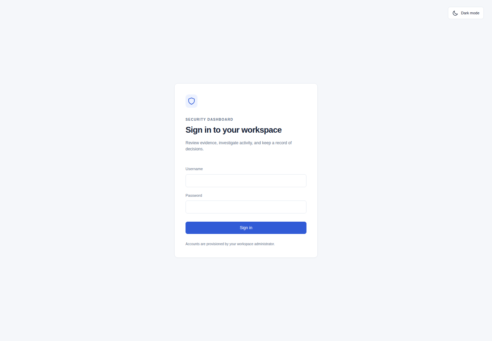

## Generate demo activity

In another terminal at the repository root, activate the backend environment and run:

```bash
source backend/venv/bin/activate
python backend/manage.py seed_demo --scenario normal --ip 198.51.100.10
python backend/manage.py seed_demo --scenario brute-force --ip 203.0.113.50
python backend/manage.py seed_demo --scenario rate-abuse --ip 203.0.113.77
```

| Scenario | Appended activity | Expected result on a fresh source |
| --- | --- | --- |
| `normal` | 3 successful attempts | Ordinary events |
| `brute-force` | 6 failed attempts | High-severity brute-force finding |
| `rate-abuse` | 11 successful attempts | Medium-severity rate-abuse finding |

The command **appends** data and never resets existing records. Reusing an IP can combine activity with earlier events and is subject to the finding cooldowns below. This command is a trusted local operator tool; network ingestion requires administrator authentication.

The Events view refreshes every five seconds. Use **Refresh** to update it immediately; refresh the investigation queue when looking for a newly generated finding.

## Workspace guide

### Events: monitor and explore

The overview cards count total, successful, failed, and suspicious **events**, rather than distinct sources or findings. Charts show hourly activity over the last 24 hours and top source IPs.

Use the event explorer to:

1. Search for an IP address, username, or event ID.
2. Combine result, detection flag, and time-range filters.
3. Browse 25-row pages.
4. Choose **Details** to view a record, including its raw JSON.
5. Drill into that source's events from the detail dialog.
6. Export the complete filtered result as CSV, including rows beyond the current page.

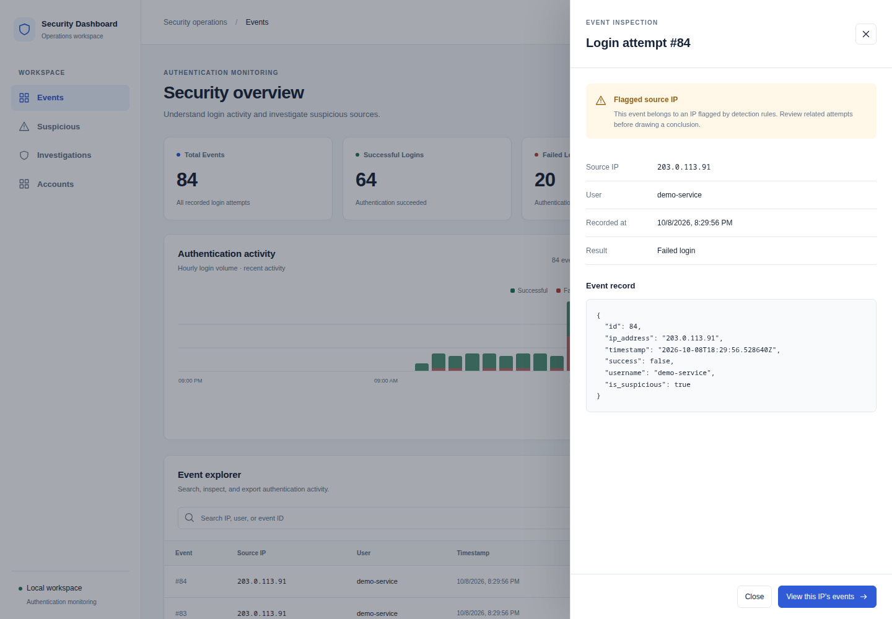

Filtering, charts, and paging currently run in the browser over the API's full event list. CSV export escapes values that could be interpreted as spreadsheet formulas. If a refresh fails, the UI reports the error; previously displayed data may be stale.

### Suspicious: triage flagged activity

Open **Suspicious** to focus on flagged events. The same search, filters, inspection, and export tools help you narrow down a source before reviewing its finding.

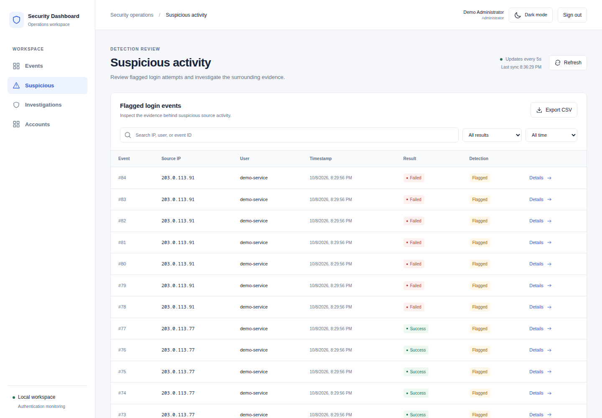

A flag indicates that a rule triggered for the source. It is a prompt for review, rather than proof that an individual event was malicious. Flags persist even after an investigation is resolved.

### Findings: understand why a rule fired

Open **Investigations → Findings**. Search the queue and filter by severity, then choose **Review finding**.

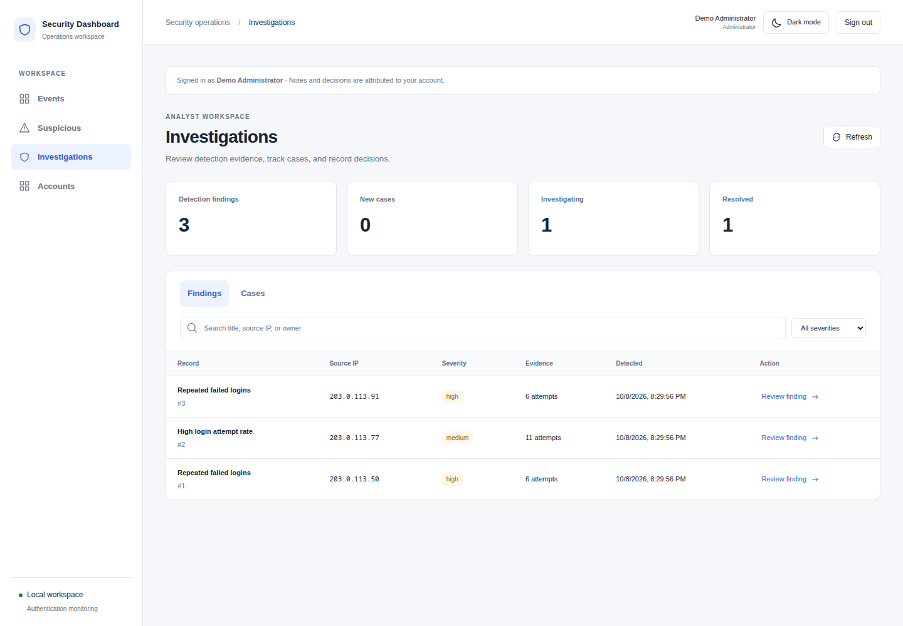

The detail view records the rule version, threshold, observed count, detection window, and matching event snapshots. Evidence is captured at detection time; later logins do not extend that snapshot.

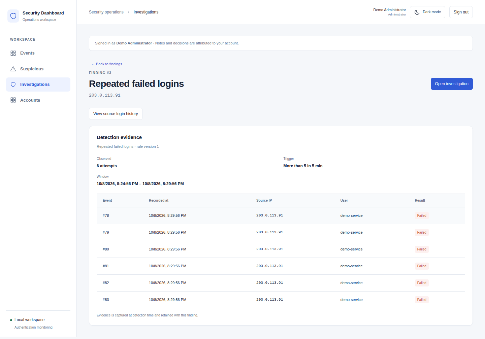

Use **View source login history** to compare the evidence with broader activity. Analysts and administrators can choose **Open investigation**. If a case already exists, **View investigation** opens it; each finding has at most one case.

### Cases: coordinate the investigation

Switch to **Investigations → Cases** to see case status and assigned owners. Search by title, source IP, or owner, and narrow the queue by severity and status.

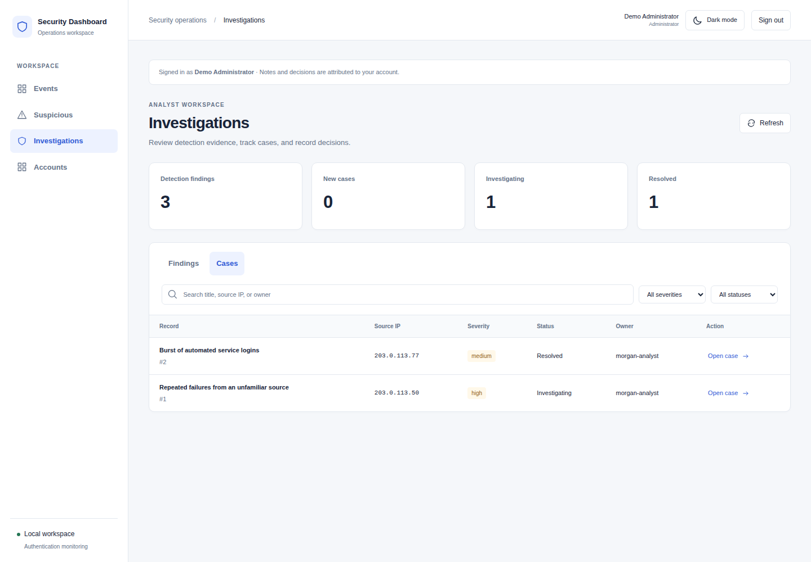

Inside a case, assign an active analyst or administrator, adjust severity, and choose **Start investigation**. Add notes describing the evidence you reviewed and your next steps. Notes and changes retain the authenticated author's identity and time.

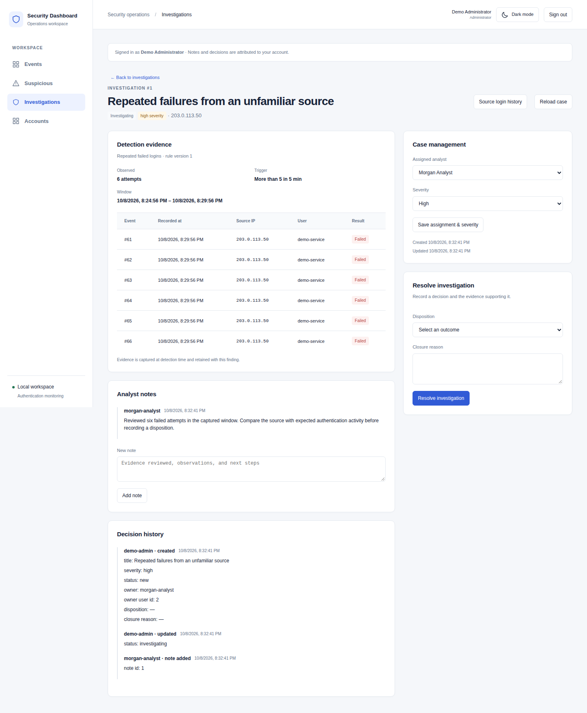

To resolve an investigating case, select **True positive**, **False positive**, or **Benign activity**, and supply a closure reason. The saved decision appears alongside the evidence and history.

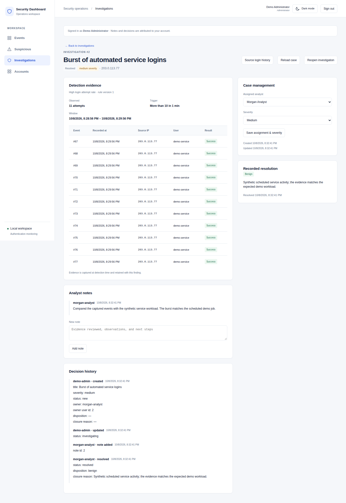

**Reopen investigation** returns a resolved case to Investigating. Its previous decision stays in history. Case links use `#investigations/<id>` and can be bookmarked; authentication is still required. If another analyst has saved a change first, reload the case before editing again.

### Accounts: manage workspace access

Administrators can create accounts with an initial password, change roles, deactivate accounts, and review the latest 100 access-history entries. Deactivation preserves case attribution. The backend prevents removal of the last active administrator.

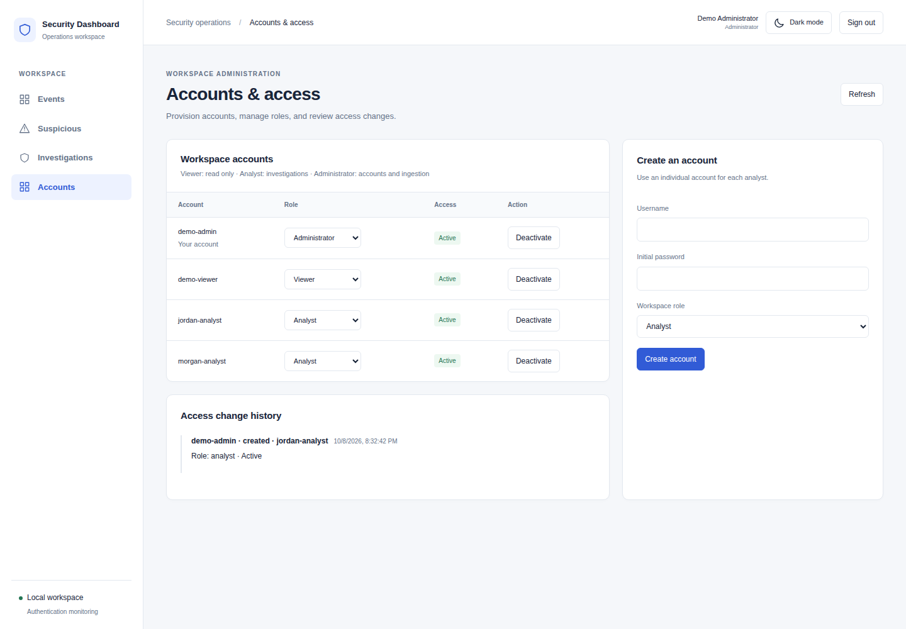

For password recovery, a local operator can run:

```bash
python backend/manage.py changepassword <username>
```

### Light and dark mode

Use **Dark mode** or **Light mode** at the top right, including on the sign-in screen. The preference is saved in this browser's local storage.

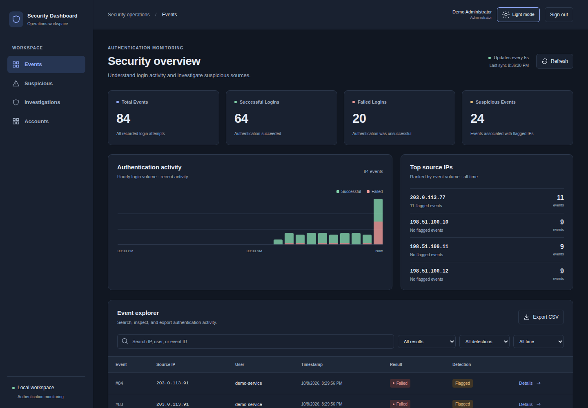

## Your first investigation

1. Generate the `brute-force` sample activity above.
2. In **Events**, search for `203.0.113.50` and inspect a failed attempt.
3. Open **Investigations → Findings**, refresh, and review the brute-force finding for that source.
4. Check the six captured failures and the five-minute detection window.
5. Choose **Open investigation**, assign an analyst account, and start investigating.
6. Add a note explaining what you observed and what you checked.
7. Resolve the case with a disposition and a reason supported by your review. For this synthetic exercise, explain that the attempts were generated by the demo command.
8. Return to **Cases** to confirm the saved status, or reopen it to continue the exercise.

## Roles and access

| Capability | Viewer | Analyst | Administrator |
| --- | :---: | :---: | :---: |
| Read events, findings, cases, notes, and case history | ✓ | ✓ | ✓ |
| Use event filters and CSV export | ✓ | ✓ | ✓ |
| Create and update cases, add notes, resolve and reopen | — | ✓ | ✓ |
| Manage accounts and review access history | — | — | ✓ |
| Ingest reported events through the API | — | — | ✓ |

Permissions are enforced by the backend, including after account changes affect an existing session. All accounts share one workspace; organization and tenant isolation are not implemented. Older self-reported attribution is marked **Legacy label** rather than being treated as a verified account identity.

Authentication uses Django sessions, HttpOnly session cookies, and CSRF protection. Sessions last 12 hours. Passwords and session tokens are not saved in browser local storage. Sign-in is limited to 10 attempts per minute per remote IP using a process-local cache.

## Detection behavior

| Rule | Trigger for one reported source IP | Severity | Finding cooldown |
| --- | --- | --- | --- |
| Brute force | More than 5 failed attempts within 5 minutes | High | 5 minutes |
| Rate abuse | More than 10 total attempts within 60 seconds | Medium | 60 seconds |

Ingestion validates and stores an event, then evaluates both rules. If either fires, **all stored events for that IP are flagged, including older events**. Flags do not automatically clear. Finding creation is limited per IP and rule during its cooldown; later matching activity can create another finding once that cooldown expires.

Findings preserve their original evidence independently of event flags. Historical flags alone are not converted into findings. The IP address is supplied by the reporting client; the application does not establish that it is the actual network source.

## Architecture and API

```text
Security-Dashboard/
├── backend/
│   ├── app/              # Events, detection, investigations, accounts, tests
│   ├── config/           # Django settings and root routes
│   ├── manage.py
│   └── requirements*.txt
├── frontend/
│   ├── src/              # React workspace, session handling, themes
│   ├── tests/            # Built-application tests
│   └── vite.config.js    # Local API proxy
├── docs/                 # Roadmap and README screenshots
└── .github/              # CI and Dependabot configuration
```

The browser talks to the Django API through Vite's same-origin local proxy. Django stores events, finding snapshots, accounts, cases, notes, and histories in SQLite. Event monitoring uses five-second polling; investigation pages offer manual refresh.

<details>
<summary><strong>API reference and integration notes</strong></summary>

Paths below have no trailing slash. Workspace reads require a signed-in account with a workspace role; writes require the role indicated and a valid CSRF token.

| Method | Path | Purpose / access |
| --- | --- | --- |
| GET | `/auth/session` | Current user or null, plus a CSRF token; available before sign-in |
| POST | `/auth/login`, `/auth/logout` | Sign in / out with CSRF protection |
| POST | `/login-attempt` | Report `ip`, `success`, optional `username`; administrator |
| GET | `/events`, `/suspicious`, `/stats` | Event lists and event counts; workspace roles |
| GET | `/findings`, `/findings/<id>` | Finding summaries and captured evidence; workspace roles |
| GET/POST | `/investigations` | Read queue / create from `finding_id`; creation requires analyst/admin |
| GET/PATCH | `/investigations/<id>` | Read / update case; updates require analyst/admin |
| POST | `/investigations/<id>/notes` | Append `text`; analyst/admin |
| GET | `/users/assignable` | Active analyst/admin accounts eligible for assignment; workspace roles |
| GET/POST | `/users` | List / provision accounts; administrator |
| PATCH | `/users/<id>` | Change `role` or `is_active`; administrator |
| GET | `/users/access-history` | Latest 100 account access changes; administrator |

Fetch `/auth/session` first, retain cookies, and send the returned token as `X-CSRFToken` for writes. Sign-in rotates the CSRF token and returns its replacement. Never commit credentials or cookie jars.

Case updates require the current `revision`; stale edits return **409**. Assignment uses `owner_user`, an eligible account ID or null. Resolving requires `status: "resolved"`, a `disposition` of `true_positive`, `false_positive`, or `benign`, and `closure_reason`. Duplicate case creation returns the existing case. Actor and author identities come from the session; supplied identity fields are rejected.

The investigation queue API supports `status`, `severity`, `source`, and exact `owner` filters. Lists remain unpaginated. There are no case deletion or history-editing endpoints. Invalid login-event input returns **400**; successful ingestion returns **201**.

For a separate API origin, set `VITE_API_BASE` before starting/building the frontend and configure exact comma-separated `CORS_ALLOWED_ORIGINS` and `CSRF_TRUSTED_ORIGINS` in Django. Include credentials and use consistent local hostnames. Cross-site hosting requires deliberate HTTPS and cookie configuration; restart services after configuration changes.

</details>

## Development and CI

With the backend environment active, run from the repository root:

```bash
python -m pip install -r backend/requirements-dev.txt
ruff check backend
python backend/manage.py check
python backend/manage.py makemigrations --check --dry-run
python backend/manage.py test app --verbosity=2
pip-audit -r backend/requirements-dev.txt

npm --prefix frontend ci
npm --prefix frontend run lint
npm --prefix frontend test
npm --prefix frontend audit --audit-level=low
```

`npm test` builds the production bundle and runs the frontend tests. To build or inspect it separately:

```bash
npm --prefix frontend run build
npm --prefix frontend run preview
```

Output goes to `frontend/dist`. Preview also uses the local API proxy, so keep Django running. A hosted build needs a configured API origin or a reverse proxy for the API routes.

[CI](.github/workflows/ci.yml) runs on pushes, pull requests, manual dispatch, and weekly on Mondays at 07:17 UTC:

| Check | Coverage |
| --- | --- |
| Backend / Python 3.12 and 3.14 | Ruff including security rules, configuration, fresh migrations, migration drift, backend tests |
| Frontend / Node 22 and 24 | ESLint, production build, built-application tests |
| Dependency security | `pip-audit` and `npm audit`, including development dependencies |

[Dependabot](.github/dependabot.yml) proposes weekly Python, npm, and GitHub Actions updates. Actions are pinned to commit hashes; workflow permissions are read-only and checkout credentials are not persisted. Dependency findings and audit-service failures fail the security job.

To make passing CI a merge requirement, create or edit a GitHub ruleset targeting `main` under **Settings → Rules → Rulesets**, enable **Require status checks to pass**, and select these checks after a workflow run:

- **Backend / Python 3.12**
- **Backend / Python 3.14**
- **Frontend / Node 22**
- **Frontend / Node 24**
- **Dependency security**

Requiring checks is a repository setting, separate from the workflow file. Backend tests use isolated test databases. Frontend tests use JSDOM with controlled API responses; they complement real-browser review.

## Troubleshooting

| Symptom | What to check |
| --- | --- |
| Empty events or findings | Generate demo activity, refresh, and clear restrictive filters. Findings require a threshold crossing. |
| UI cannot connect or shows stale data | Keep Django running on port 8000; check both terminal logs and the Vite proxy configuration. |
| Port already in use | Stop the old local server or choose another port and update the proxy target to match. |
| Sign-in fails | Use the account created by `createsuperuser`; check that it is active. Reset its password with `changepassword`. |
| Actions unavailable | Check your role. Viewers cannot modify cases; only administrators manage accounts. |
| CSRF or cookie errors | Use the Vite frontend URL consistently; avoid mixing `localhost` and `127.0.0.1` across separate origins. Check trusted origins if customized. |
| Database/table errors after pulling changes | Activate the backend environment and run `python backend/manage.py migrate`. |
| Case update conflict | Choose **Reload case**, review the latest record, then retry your edit. |
| No new finding after repeated demo runs | Check the IP/rule cooldown. Try a different documentation-range IP for an independent example. |

## Scope and next steps

The default settings enable DEBUG, use a publicly known development secret, configure cookies for local HTTP, and use SQLite. Detection is synchronous, API lists are unpaginated, and monitoring polls. This project does not include Docker/Compose, nginx configuration, an external attack simulator, real authentication enforcement, or automatic containment.

Before public hosting, the deployment work needs production settings and secrets, HTTPS cookies, shared proxy-aware abuse protection, supported infrastructure, and backups and monitoring. Email recovery/verification and MFA are also future work. Automated checks reduce risk but do not certify production readiness.

The next planned application milestone is **server-side event search and pagination**, followed by further deployment work. See the [development roadmap](docs/ROADMAP.md) for the proposed delivery order.
